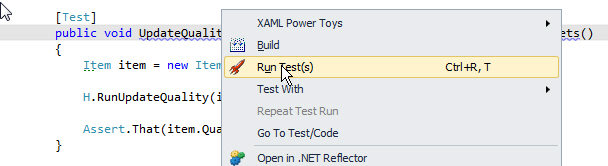

### Option 1: External tool (not recommended)

Using NUnit with Visual Studio: To make it easy to use, you need to add it as an external tool in Visual Studio.

In Visual Studio:

1. Go to Tools > External Tools
2. Click "Add" button
3. Type in:

- Title: NUnit GUI
- Command: Location of nUnit.exe file
- Argument: /run (so that the tests run automatically when started)
- Initial Directory: $(Target directory)

 
[[badExample]]
| 
### Option 2: Test Driven .net

TestDriven.net has better NUnit integration – from both code and Solution Explorer windows.

(s)' command for a single test (above) or...

To run unit testing: Tools > NUnit GUI to launch NUnit and run the tests.

### Option 3: Other Tools

Other Visual Studio tools including Resharper and Coderush have their own integration with NUnit. If you’re already using one of these, installing TestDriven.net is unnecessary.
