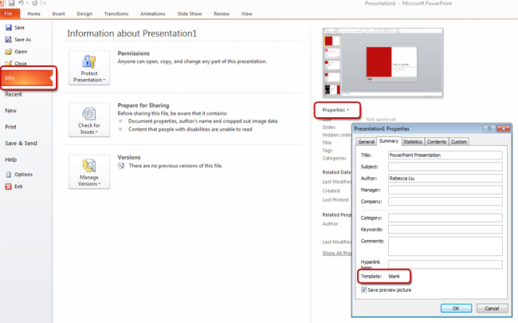

Unfortunately, there is no easy solution to this. What we need is a 'version' field and an 'Update' button - See our **[Suggestions to Microsoft PowerPoint: Check for Updates](http://www.ssw.com.au/ssw/Standards/BetterSoftwareSuggestions/Office.aspx#Version)**
Figure: This is how you can see if you are using the template file 
