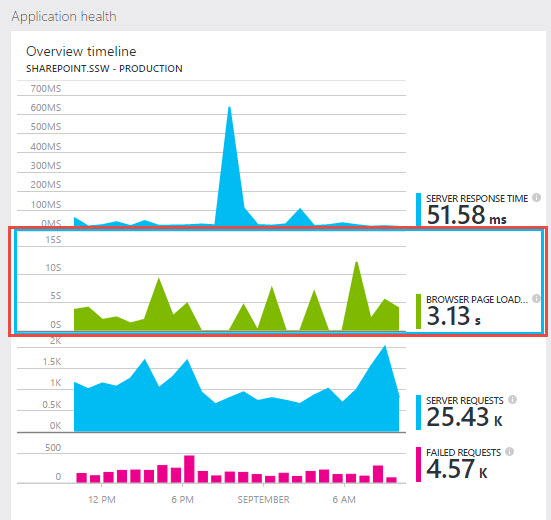

The easiest way to get started with Application Insights is to follow the documentation on MSDN https://azure.microsoft.com/en-us/documentation/articles/app-insights-get-started/

Lets take a look at the overview and our tips to help you get the most out of Application Insights.
 
**An overview of the setup steps** Application Insights requires that you make 2 general modifications to your application:

1. On the client side, manually[add a Javascript tracker to your web page header](https://azure.microsoft.com/en-us/documentation/articles/app-insights-javascript/) (i.e. by placing directly on each page or through a "master page" or "layout template"), this modification enables the "browser page loading time" monitor and can track client-side exceptions:  Browser side stats have been enabled with the JavaScript tracker
2. On the server side, [add the Application Insights DLL references and update web.config](https://azure.microsoft.com/en-us/documentation/articles/app-insights-start-monitoring-app-health-usage/), these modifications enable the "server response time", "server request" and "failed requests" monitors. This step can either be done within Visual Studio when right-clicking on a project in Solution Explorer, but it can also be done with the server monitoring tool on ASP.NET applications you don't have control over (e.g. SharePoint).
3. Server side stats have been enabled now that it has been added to the ASP.NET pipeline

**Tip #1 – Add enhanced Exception tracking to your application** 
The default set up and configuration of Application Insights will send generic performance stats and Exceptions. If you will be using Application Insights to look deeper into these Exceptions then it is important to make sure the full stack trace is sent when Exceptions occur. This can be added to your application by adding code for all unhandled exceptions. Follow this documentation page for more information https://azure.microsoft.com/en-us/documentation/articles/app-insights-asp-net-exceptions/

**Tip #2 – Add Web tests to monitor performance metrics over time
** As soon as you have configured Application Insights, you should immediately add a web test to track the general performance trends  over time. More information can be found at this rule [https://rules.ssw.com.au/do-you-add-web-tests-to-application-insights-to-montior-trends-over-time](/_layouts/15/FIXUPREDIRECT.ASPX?WebId=3dfc0e07-e23a-4cbb-aac2-e778b71166a2&TermSetId=07da3ddf-0924-4cd2-a6d4-a4809ae20160&TermId=1ff43a84-e259-48c5-8b7a-f48433a7ec3c)

**Tip #3 – What if you don't have the source code of your ASP.NET application **

This rule on how to add Application Insights to a SharePoint application shows that you can use the Application Insights monitor to add the .dlls and modify the web.config file of a deployed application https://rules.ssw.com.au/application-insights-in-sharepoint
