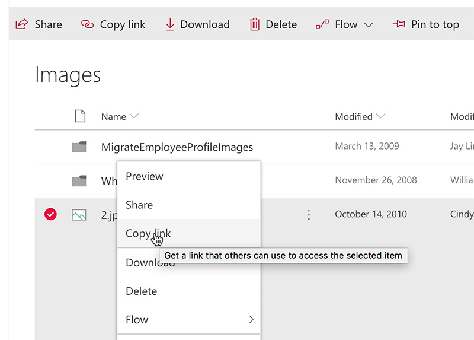

You often need to share links to a file or folder in SharePoint. 

<!--endintro-->

You can select the folder (or file) and click on "Copy link" at the top bar to get the link:
<dl class="image"><dt>
      
   </dt><dd>Figure: Getting URL from SharePoint top bar </dd></dl>
You can also right-click the folder/file to copy the link:
<dl class="image"><dt>
      
   </dt><dd>Figure: Getting URL by right-clicking a file in SharePoint 
       </dd></dl>
On previous versions, you can open the menu on ellipsis link and get it from there:
<dl class="image"><dt>
      
   </dt><dd>Figure: Getting URL from SharePoint ellipsis menu </dd></dl>
###  Related Rule

* [Do you know not to send attachments in emails?](/do-you-know-not-to-send-attachments-in-emails)
