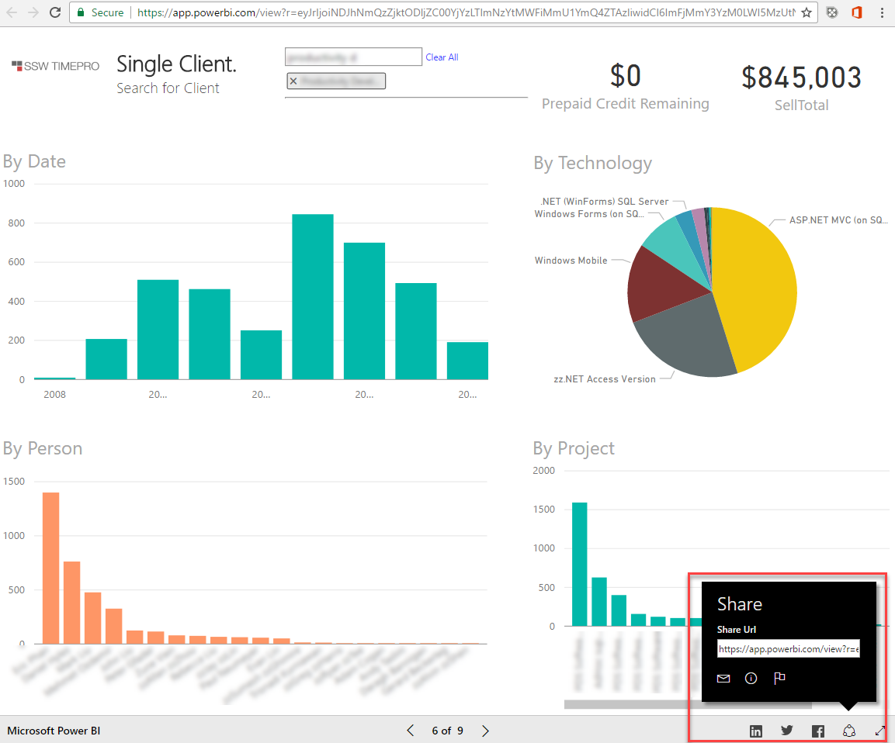

The problem with the standard File | Publish to Web options, is it always goes to the same tab of a report, but if you want to send a link to a specific tab, you have to do one more step...
 
Do the above as usual, and then go to that published public report, and navigate to the tab you want to send people to.

At the bottom right hand corner of the screen, there is a share icon. Click this for a sharable URL for that tab (people can still navigate to other tabs as needed, but will start on the one you've chosen.

