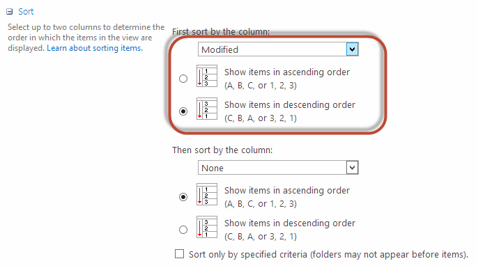

You may know that it is quite easy to sort view by a column through the UI.

But when you are trying to do that via code, you may find a pretty tricky issue.
   You can use some code like:

view.Query = "**FALSE**\" />";
Figure: Use code to change view sort
but the below code won't work:

view.Query = "**False**\" />";
Bad Example - the Ascending attribute is case-sensitive

The full code should be some code like:

SPView view = list.DefaultView;
view.Query = "**FALSE**\" />";
view.Update();
Good Example - the Ascending attribute is using capital charactors as it is case-sensitive
