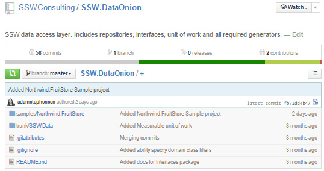
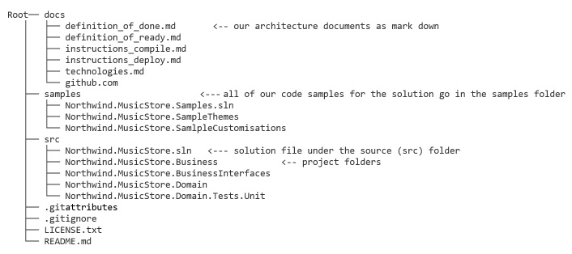

It  is important when working in multiple projects to ensure consistent practices.

Structuring your repositories consistently makes your project feel professional, and makes it easier to work with as it is predictable.
 
[[badExample]]
| 
[Do you review the documentation?](/_layouts/15/FIXUPREDIRECT.ASPX?WebId=3dfc0e07-e23a-4cbb-aac2-e778b71166a2&TermSetId=07da3ddf-0924-4cd2-a6d4-a4809ae20160&TermId=951ffbf9-4066-42f3-a9b7-e0d8603e728b)
[[goodExample]]
| 
