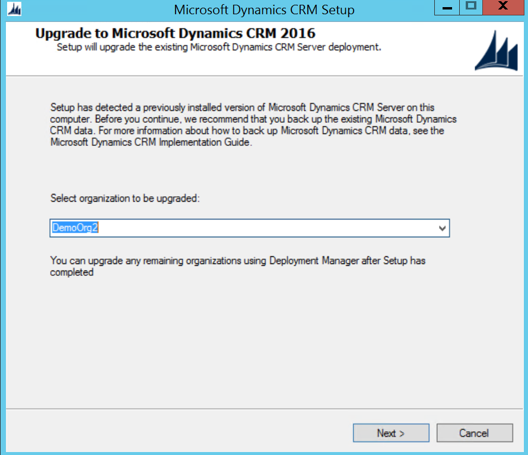
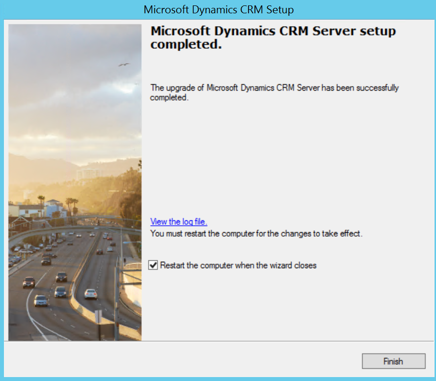
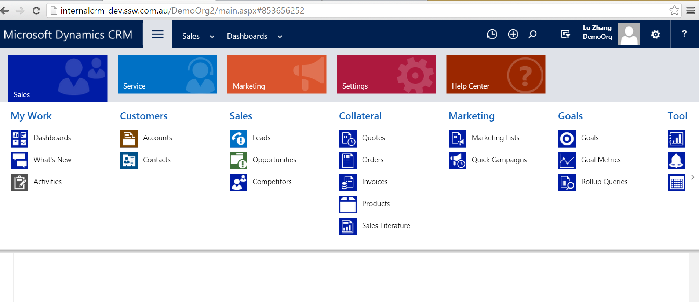
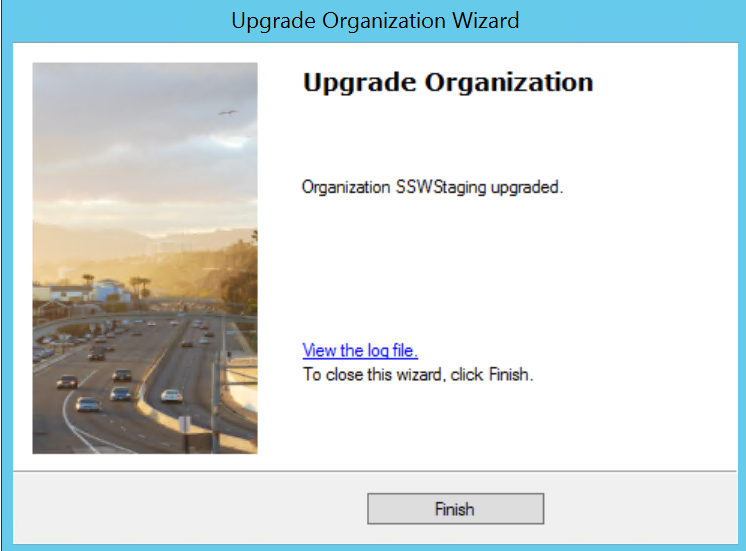
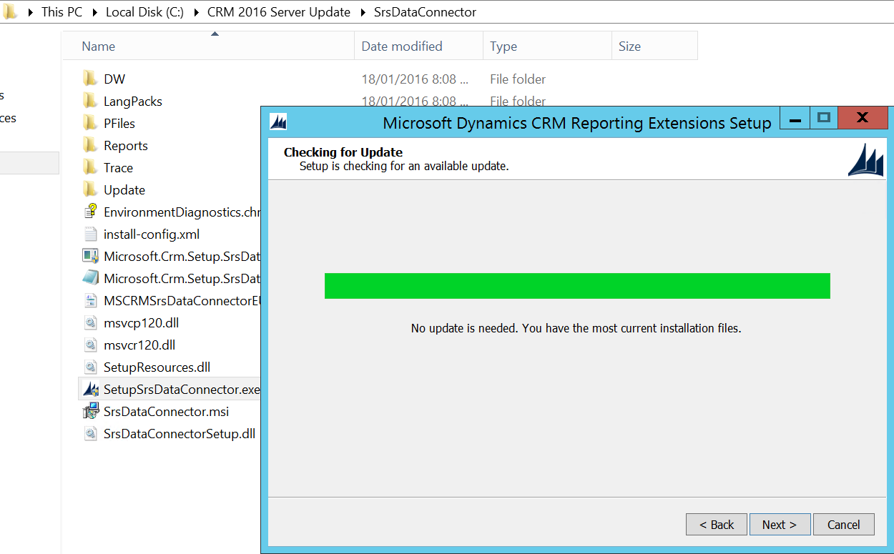
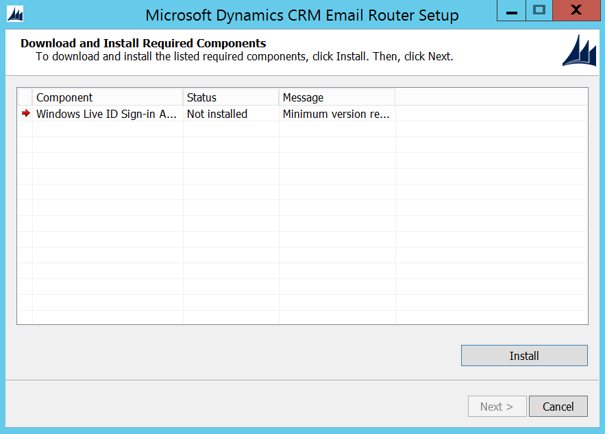
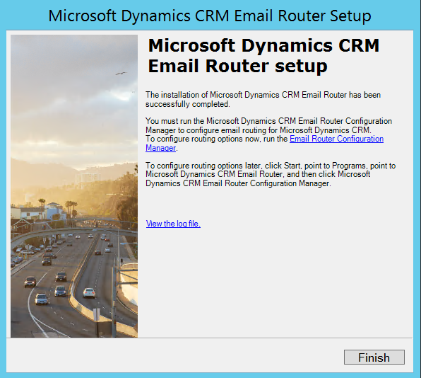
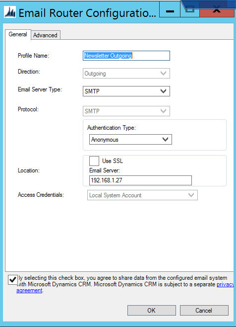

CRM 2016 has many improvements over it's predecessors, including Power BI integration, improved navigation, and the new Outlook extension.

The procedure for upgrading CRM 2015 to 2016 is: 
<!--endintro-->

1. Apply Windows Update on CRM and Database servers

2. Go to CRM server | Deployment Manager | Disable CRM organization
 ** 
 ** **Figure: Disable organization** 
3. Back up CRM organization database and configuration database

4. Go to CRM server | Control Panel | Uninstall "Microsoft Dynamics CRM Reporting Extensions"

 **Figure: Uninstall CRM Reporting Extensions** 
5. Download [CRM 2016 Server installation file](https://www.microsoft.com/en-us/download/details.aspx?id=50372) and start the upgrade

Note: It's better to have an empty demo organization to be upgraded first, so that you can test if the server upgrade has no issues.
 **Figure: Select the demo organization to be upgraded**  ** Figure: Upgrade business organization  Figure: Successfully upgrade organization  
   ** **Figure: Quick test on the demo organization** **Figure: Successfully upgraded CRM server** 
6. Go to CRM setup directory | SrsDataConnector | Install 'Microsoft Dynamics CRM Reporting Extensions"

If using Email Router, do the following 2 steps to upgrade Email Router to 2016

 **Figure: Successfully upgraded to CRM2016** **Figure: Install CRM Reporting Extensions** 
7. Go to CRM server | Uninstall "Microsoft Dynamics CRM 2015 Email Router"
 ** 
 ** **Figure: Uninstall Email Router 2015** 
8. Download [CRM 2016 Email Router](https://www.microsoft.com/en-us/download/details.aspx?id=50373) and install
 **Figure: Install required components for Email Router 2016**  **  Figure: Configure Email Router ** **Figure: Successfully installed Email Router 2016** 
You're now ready to roll with Microsoft Dynamics CRM 2016. If you had any trouble with this guide, please let us know with a rating of this rule.
