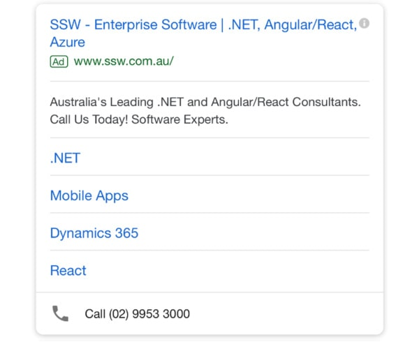

Ad extensions are additional pieces of information about your business, like a phone number or a link to a specific page on your website, that we can add to your ads. Keep in mind that ad extensions can improve the visibility of your ads, which can lead to more clicks and improve your ROI. It’ll give the ad greater visibility/prominence, so you tend to get more value from your ad. These are the possibilities:
 
- **App extensions** – downloading an app (when appropriate to your business)
- **Price extensions** – price transparency on a showcase
- **Location extensions**  – promoting locations (Google my Business)
- **Message extensions** – offers a possibility of the viewer sending the company a Text/SMS (Although is not possible to track this conversion)
- **Call Extensions**  – provides the ad a phone number to make calls through mobiles
- **Structured Snippets** – provide advertisers 3 additional headlines of text to highlight key aspects of our business
- **Promotion**  – coupons, deals, sales offerings
- **Call out**  – Additional detail/an invitation to a call-to-action
- **Sitelinks**  – Promoting links from your website you want to advertise

[[badExample]]
| 

[[goodExample]]
| 
