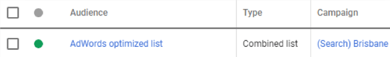
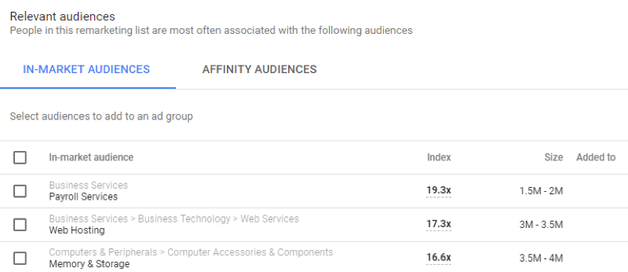

Audiences, in general, will allow you to try pulling up your ads to different groups of people based on tons of different criteria.
 
- **Affinity Audience** – Show your ads to unique audiences based on their lifestyles, buying habits, and long-term interests that you can pick.
- **Custom Affinity Audience** – Show your ads to specific audiences based on the affinity selections that you can choose to create a custom audience.
- **In-Market Audience** – Find customers who are researching and are actively looking into buying a service or product you sell.
- **Remarketing & Similar Audiences** – Show your ads to people who have visited your website previously before (You can choose the period) or viewed your content somewhere online. This would include remarketing lists.

](audience-1.png)
To be able to choose your audience and even create remarketing actions, you will have to use the tool “Audience Manager". Click on: Tools | Shared Library | Audience Manager

You'll find: Audience lists, Audience insights and sources.

On Sources, you can link Google Analytics, YouTube (if you use this social media), Google Play and App Analytics (if you sell apps). All of this will bring information that will help you build your custom audience.

To build your In-Market and Affinity audiences, you can select from some options that Google will give you like below:

