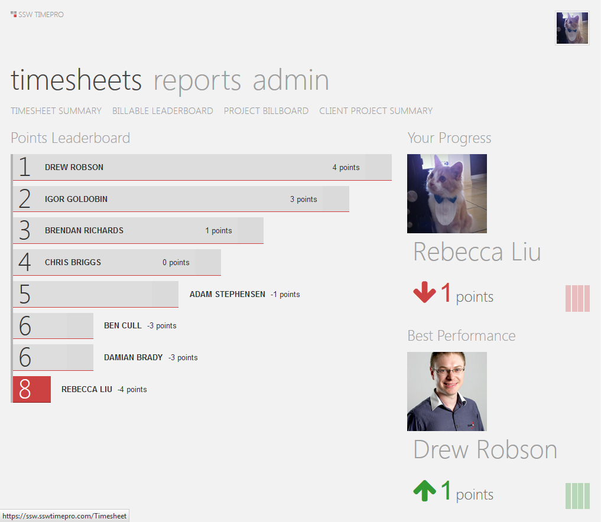

"Gamification" is a method of encouraging user participation. Usually, these are a set of incentives such as points or achievement badges which are linked to some other form of redeemable value.
 
It originated with Frequent Flyer programs and has crossed over into the software world with the success of Foursquare.

This concept is being utilized even in     [Visual Studio](https://channel9.msdn.com/achievements/visualstudio). 

](stack-overflow-reputation.jpg)

