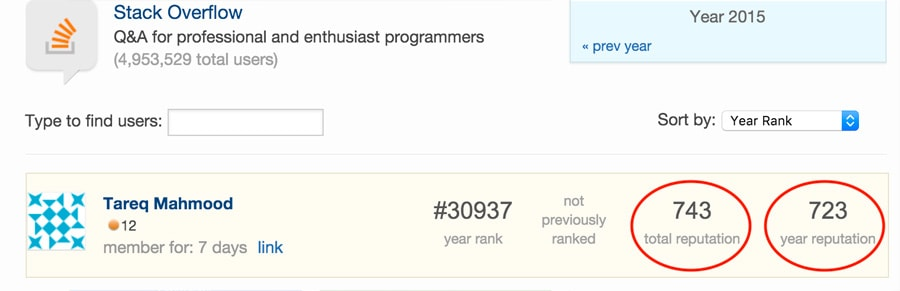

"Gamification" is a method of encouraging user participation. Usually, these are a set of incentives such as points or achievement badges which are linked to some other form of redeemable value.

<!--endintro-->

It originated with Frequent Flyer programs and has crossed over into the software world with the success of Foursquare.

This concept is being utilized even in     [Visual Studio](https://channel9.msdn.com/achievements/visualstudio). 

[[goodExample]]
| 

[[goodExample]]
| 
[[goodExample]]
| 
[[goodExample]]
| 

[[goodExample]]
| 
