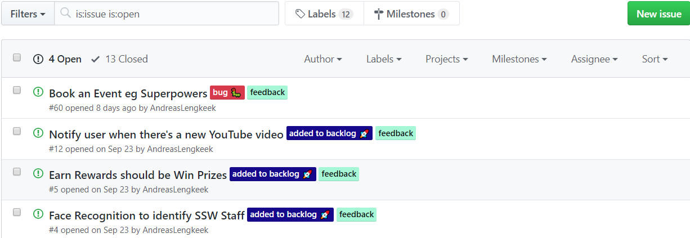

It is important that you know how to use labels for GitHub issues when using an open source project on GitHub.

Managing your labels on GitHub issues will let the community feel professional and make it easier to work with as it is predictable

 When you are using an internal project management solution (such as Azure DevOps) for an open source project. It is a good idea to use labels to demonstrate that an issue is being worked on to the community.
This way you can give the community an understanding of the current goals of the project and a higher feeling of interactivity with your development team.
Bad Example: It is hard to understand what issues are being worked on

Good Example: It is very simple to understand if an issue has received attention
