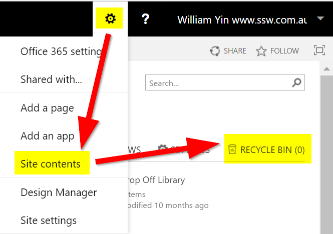

You might need to recover a delete file in SharePoint. You will find it at the Recycle bin. This is where you can find it:
 ​​
​​​
Figure: To find deleted files go to "Site Contents" > "Recycle Bin"
