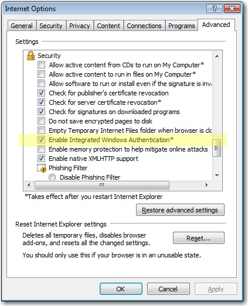
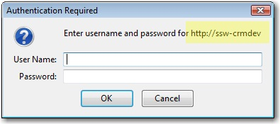
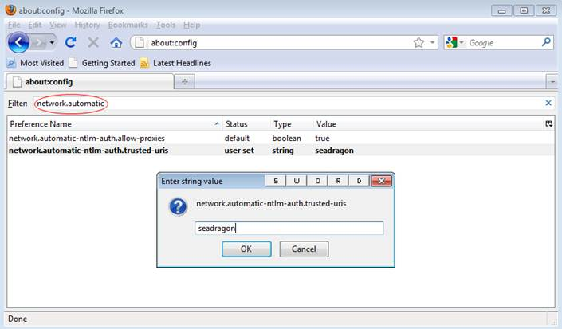
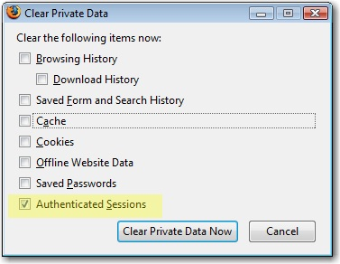

Internet Explorer has a great feature that you hardly notice. The Authentication credentials of the current user will be used by default.

In Firefox, if you sign-in to an internal server like SharePoint or CRM, you will get an authentication dialog. Even though you are already authenticated to the local domain.

(so it works like IE) 
### The Solution

1. Open Firefox
2. Go to "about:config"
3. Click "I'll be careful, I promise!"
4. Enter in the Filter box above: "network.automatic"
5. You see 2 records
6. Double-click the second one - It is the key called network.automatic-ntlm-auth.trusted-uris
7. Enter the servers delimited by ",", e.g. "aphrodite, mermaid"
8. Close browser and test

 

More info on this blog: [Firefox and Sharepoint](http://www.cauldwell.net/patrick/blog/PermaLink%2cguid%2cc7f1e799-c4ae-4758-9de7-5c3e7a16f3da.aspx).

**Tip:** To test this without the Integrated Authentication enabled, you need to clear your session. You do this via:  **Tools** |  **Clear private data** |  **Authenticated Sessions** .

(SharePoint, CRM)
