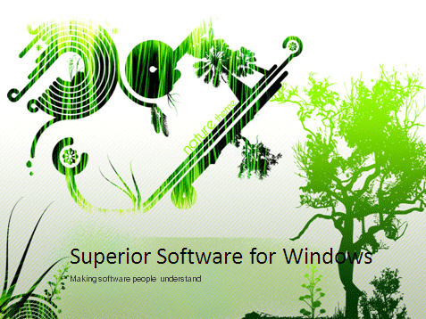

PowerPoint templates are designed to engage your audience visually and save you time. When you start creating a new presentation file, always make sure you use a template.   
[[badExample]]
|  
(in this case not SSW) 
[[goodExample]]
|  

**More Information:**

[[badExample]]
|  

[[goodExample]]
| 
