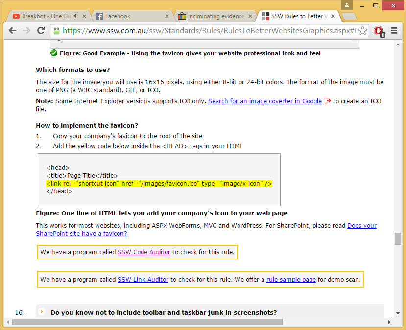
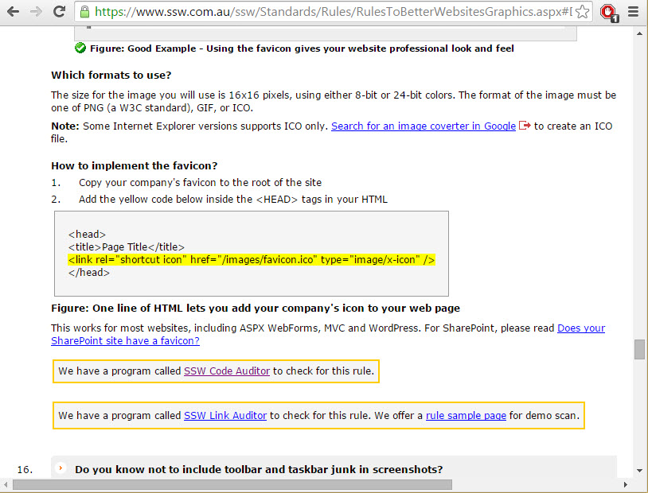
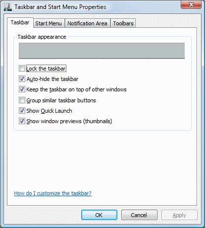

 
Screenshots are a very important part of websites these days. Be careful to avoid unnecessary toolbars and taskbars in screen shots.
 Figure: Bad Example - This screenshot includes personal browsersFigure: Good Example - This screenshot has been cropped to hide personal browsers
Tips:

1. Use a region screen shot if appropriate (however the URL is generally helpful in most browser screen shots)
2. Go full screen e.g.​ F11 in Internet Explorer, then +
3. Always have the 'Auto-hide the taskbar' option checked
Figure: Always have the 'Auto-hide the taskbar' option checked so you do be screen shots

