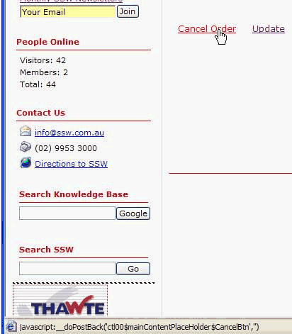
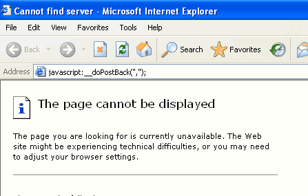

If we want to refresh and data bind the same page from client side, we can use the javascript function calls "\_\_doPostBack". We shouldn't fire this post back in LinkButton. Otherwise, there will be an error.
 

ASPX:

 
 

 
 
 
 
 
 
 
 
 

 ID:
 Name:

C#:
protected void mUpdatePanel\_Load(object sender, EventArgs e)
{
 lblTime.Text = DateTime.Now.ToLongTimeString();
 ArrayList mList = (ArrayList)ViewState["List"];
 if (txtName.Text.Length > 0)
 {
 Client mClient = new Client();
 mClient.ID = Int32.Parse(txtID.Text);
 mClient.Name = txtName.Text;
 mList.Add(mClient);
 ViewState["List"] = mList;
 gvList.DataSource = mList;
 gvList.DataBind();
 }
}
 Sample Code​​​ 
​​​[Refresh](javascript:__doPostBack%28'mUpdatePanel',''%29;)
 Bad Code​ 

 Good Code​ 
We have a program called [SSW Code Auditor](https://www.ssw.com.au/ssw/CodeAuditor/) to check for this rule.​

​
