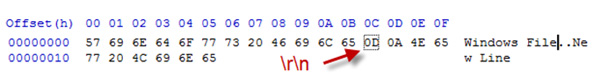

Text files created on DOS/Windows machines have different line endings than files created on Unix/Linux. DOS uses carriage return and line feed ("\r\n") as a line ending, which Unix uses just line feed ("\n").

 ](carriage-bad.jpg)
