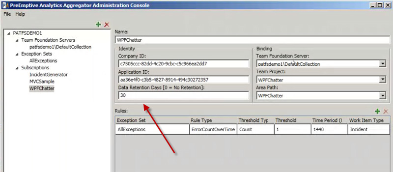

 
The widths of the fields indicate to a user the data that goes in it. Do not use a large width field when you know the entry will have only few characters (the same for small fields and large entries)
   ​Figure: Bad Example - The 'Data Retention Days' field should be reduced
