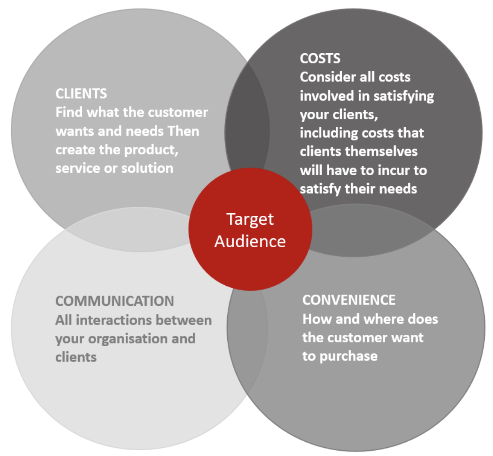

The 4 C’s of marketing can be broken down into Consumer wants and needs, Cost, Convenience, and Communication. They focus not only on marketing and selling a product but also on communication with the target audience from the beginning of the process to the very end.
 
The 4 P’s focus on a seller-oriented marketing strategy, which can be extremely effective for sales. However, the 4 C’s offer a more consumer-based perspective on the marketing strategy.

