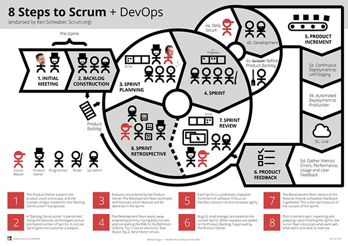

 
​​​​Scrum is easier than it seems, we'll explain how in these 8 simple steps.
 ​
Fi​gure: This Scrum image includes all the important steps from the initial meeting to the Review and Retro. Print this        [SSW 8 Steps to Scrum PDF](/Documents/8StepstoScrum.pdf) and put it on your "        [War Room](/Pages/ScrumVisualImage.aspx)" wall​

1. ### ​[Initial Meetin​g](/_layouts/15/FIXUPREDIRECT.ASPX?WebId=3dfc0e07-e23a-4cbb-aac2-e778b71166a2&TermSetId=07da3ddf-0924-4cd2-a6d4-a4809ae20160&TermId=459927ab-429c-4882-8822-ccfda6be4be6)
    ​​In the Initial Meeting, the Product Owner explains the product vision. The team think about the Architecture needed​ and how long they will need to come up with an estimate​.
2. ### ​​[Backlog Construction](/_layouts/15/FIXUPREDIRECT.ASPX?WebId=3dfc0e07-e23a-4cbb-aac2-e778b71166a2&TermSetId=07da3ddf-0924-4cd2-a6d4-a4809ae20160&TermId=e8fba769-b2de-42f5-b5a1-e6b520dab76d)
    The next step is Backlog Construction, also known as a Specification Review. The team proposes a high level software architecture and a to-do list called the Product Backlog. The required features are broken down into Product Backlog Items, or PBIs for short. These PBIs are estimated and, before a dollar figure is presented, a buffer is added for generic tasks such as DevOps, Testing, Bug Fixes, Project Management, etc.
    A quick note, there are only 3 roles in Scrum, The Product Owner (the boss), the Scrum Master (a kind of project manager), and the Team (who do the work).
3. ### [Sprint Pl​anning](/_layouts/15/FIXUPREDIRECT.ASPX?WebId=3dfc0e07-e23a-4cbb-aac2-e778b71166a2&TermSetId=07da3ddf-0924-4cd2-a6d4-a4809ae20160&TermId=ba8d0048-f440-42a6-90c0-8f79f0973d10)​

    The Sprint Planning session is for the Team to focus on the subset of the Product Backlog that they think they can complete in the next Sprint, (which is most commonl​y a 2 week time-box). The Product Owner puts t​​he PBIs into priority order and makes sure the top ones have enough detail to be worked on. The Development Team then pulls PBIs from the top of the Backlog, and commits to delivering as much as they forecast they can, in the coming Sprint.
4. ### ​​​[Sprint](/_layouts/15/FIXUPREDIRECT.ASPX?WebId=3dfc0e07-e23a-4cbb-aac2-e778b71166a2&TermSetId=07da3ddf-0924-4cd2-a6d4-a4809ae20160&TermId=731a3f5d-a266-4944-876c-a45afa82832f)​​​​​
    The Development Team works on features in priority order, having done a Daily Scrum and sending 'Done' emails once the           ['Definition of Done'](/_layouts/15/FIXUPREDIRECT.ASPX?WebId=3dfc0e07-e23a-4cbb-aac2-e778b71166a2&TermSetId=07da3ddf-0924-4cd2-a6d4-a4809ae20160&TermId=6449ae79-ba88-447e-aa48-36173029a2af) is met. A task board is often used. During this process, the team also refines items in the Product Backlog to ensure they conform to the ​['Definition of Ready'.](/Pages/Definition-of-Ready.aspx)
5. ### Product Increment​

    During the Sprint, the Development Team works on the PBIs in priority order, and then closes them once they meet the​​ 'Definition of Done', which often includes sending 'Done' emails. Every day, they do a Daily Scrum, where they go through the Task Board and talk about what they did yesterday, what they’re planning to do today, and if they have any blockers.
6. ###  ​           [Product Feedback](/Pages/CreateBugs.aspx)
    ​Product Feedback will then come in. Some will be bugs, and some will be small changes that can be added to the​​ current Sprint. Other suggestions should be approve​d by the Product Owner and then added to the Product Backlog.
7. ### [Sprint Review​​](/_layouts/15/FIXUPREDIRECT.ASPX?WebId=3dfc0e07-e23a-4cbb-aac2-e778b71166a2&TermSetId=07da3ddf-0924-4cd2-a6d4-a4809ae20160&TermId=4f02d28d-5375-4530-abcb-0b541683bcbc)

    At the end of the Sprint, there is a Sprint Review, where the Development Team demos or plays done videos of the completed PBIs. The goal is for the Product Owner to understand the increment and to discuss feedback to make the product better. This is the real measure of the success of the Sprint.
​
8. ### ​[Sprint Retrosp​​​​ective](/Pages/RetrospectiveMeeting.aspx)
    ​​Lastly, there is the Sprint Retrospective, and this is the best part! The Scrum Team discusses what went well, what didn't and what to improve, always inspecting and adapting.

      ​  
From here, another Sprint Planning session commences, and the wheel keeps turning, getting better and better with every revolution.
Figure: If you like this, retweet ​[t​witter.com/AdamCogan/status/375010501693960192​](https://twitter.com/AdamCogan/status/375010501693960192)

> New PDF for War Room: 8 Steps to Scrum - Updated to Scrum Guide 2013        http://t.co/lIvYdcDoD7 CC        [@Scrumdotorg](https://twitter.com/Scrumdotorg)[@ScrumAlliance](https://twitter.com/ScrumAlliance)
> — Adam Cogan [SSW] (@AdamCogan)     [September 3, 2013](https://twitter.com/AdamCogan/statuses/375010501693960192)

 ​  
