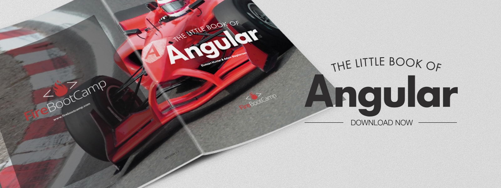

Here are the best collection of resources for Angular.

[Little Book of Angular](/SiteCollectionDocuments/Little-Book-Angular.pdf)
 
### Free Resources 

- **[The official documentation - Angular.io](https://angular.io/)**
- **NDC Sydney****- Angular War Stories** - http://bit.ly/ndc-sydney-ng2-war-stories
- **SSW TV** - http://tv.ssw.com/?s=angular

### Training Courses

- **[FireBootCamp 1-day Course](https://firebootcamp.com/angular-superpower-tour/)**
- **[FireBootCamp 2-day Workshop](https://firebootcamp.com/2-day-angular-workshop/)**
**- [FireBootCamp 6-week Online Course](https://firebootcamp.com/angular-online-course/)
- [PluralSight - Getting Started with Angular](https://www.pluralsight.com/courses/angular-2-getting-started-update)
 **

### Books

- **[Little Book of Angular](/SiteCollectionDocuments/The-Little-Book-of-Angular-v1-8.pdf)**
- **[The ng-book](https://www.ng-book.com/2/)**

### Free Events

- **[Angular Hack Day](https://angularhackday.com/)**
- **Your local JavaScript or Angular User Group**** **- https://www.meetup.com/
