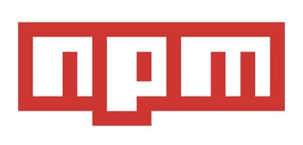

​When working with JavaScript packages there are 2 common choices:
  
 
[left-pad](https://www.theregister.co.uk/2016/03/23/npm_left_pad_chaos/) disaster of 2016 lots of developers wanted more power

(no more left-pad disasters)
