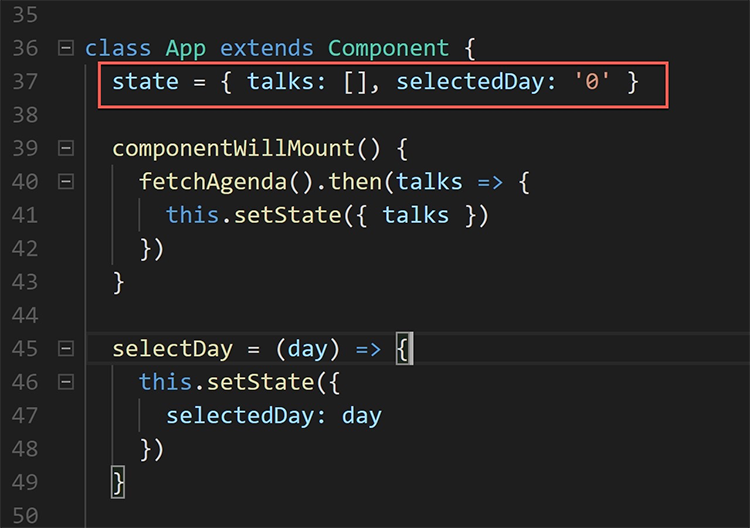

State management is complex and time-consuming.
 
The redux pattern helps resolve this issue.

The 4 principles of the redux pattern:

1. The entire state of the application is represented in a single JavaScript object called a store [https://redux.js.org/docs/basics/Store.html].
2. The store is acted upon using special functions called reducers [ https://redux.js.org/docs/basics/Reducers.html].
3. State is immutable and reducers are the only part of the application that can change state.
4. Reducers are pure JavaScript functions. This means they cannot import external dependencies.

Side Effects

To perform operations that require external dependencies (such as communicating with a web server), we can implement side effects. These can use external dependencies but they cannot directly modify the store. They can invoke reducers to modify the store when the side effect is complete

redux-saga is a library that provides redux application side effects.
The advantages of using redux-saga are:

1. Collects all asynchronous operations in one place, making the code clearer.
2. Uses an  ES6 feature called Generators to make asynchronous flows easy to read, write and test.
3. Generators also let these asynchronous flows look like your standard synchronous code (kind of like async/await in C#). This solves “callback hell” [[https://en.wiktionary.org/wiki/callback\_hell](https://en.wiktionary.org/wiki/callback_hell)]
