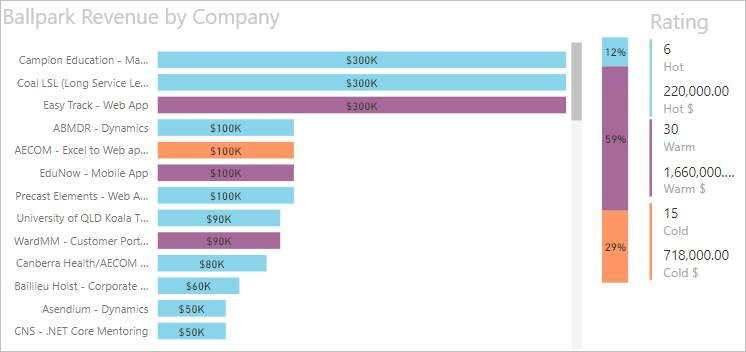
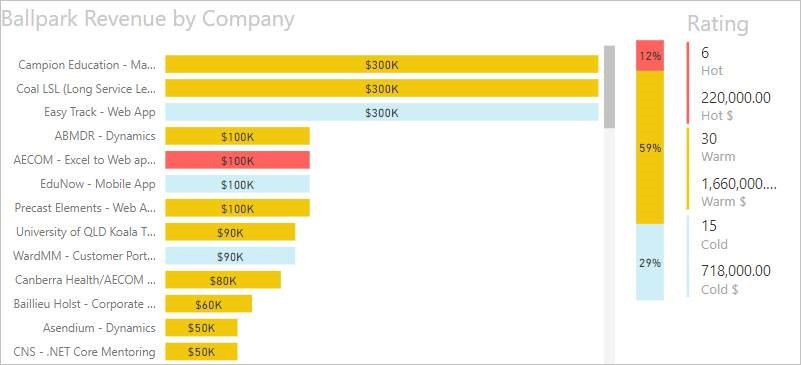
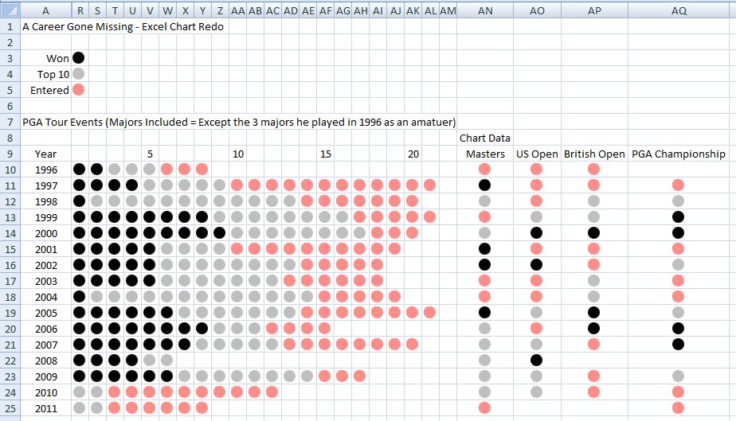
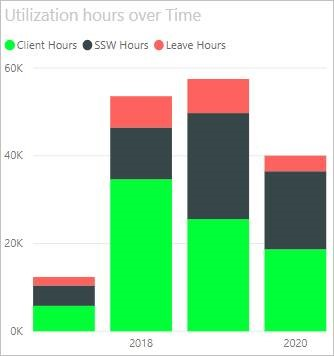
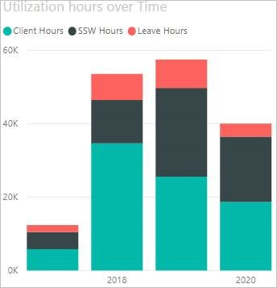

Using colour in reports can bring them to life, or else make them confusing and noisy, so make sure you’re intentional with them.

<!--endintro-->

### Semantic colours

Remember that some colours have a shared understanding of their meaning.

* **Red** means pay attention or danger.
* **Green** often means good.
* Traffic lights can be used for showing 3 levels.
* Cold, Warm, Hot should have appropriate colours that make sense without having to look at the legend

[[badExample]]
| 
[[goodExample]]
| 
### Tufte minimalism

Edward Tufte is often quoted as saying that, on a report where you want to draw the eye to exceptions or out of bounds data, colour should only be used to highlight what you want the user to see.

[[goodExample]]
| 
### Consistent Palette

Make sure you stick with one colour palette, so if you use one pastel colour, make them all pastel. If you have one bold colour, make them all bold

[[badExample]]
| 
[[goodExample]]
| 
### Colour Blind palette

Just to be difficult, it is worth noting that red/green colour blindness is the most common type, which may make standard semantic colours sometimes less desirable. In this case, use blues and oranges for contrast instead.
