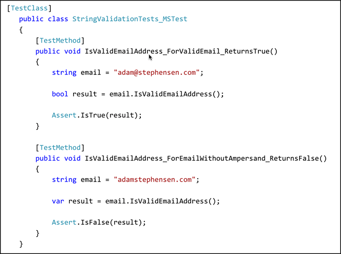

When getting started with unit testing, it is important to use the right tools for the job.
 Bad Example: MS Test was the default testing library for previous versions of .NET and Visual Studio but lacked many features that were available in more complete tools like NUnit
OK Example: NUnit - For previous versions of .NET, NUnit was the best testing library but required work on the Continuous Integration server to get the unit tests to run in a CI environment. One of the key features that NUnit had that MS Test didn't was the TestCase attribute that allows you to specify inline data to be used when invoking that test
  Good Example: XUnit comes out of the box with .NET Core and includes most of the great features of NUnit, while also being supported out of the box with Team Foundation Server and Visual Studio Team Services
