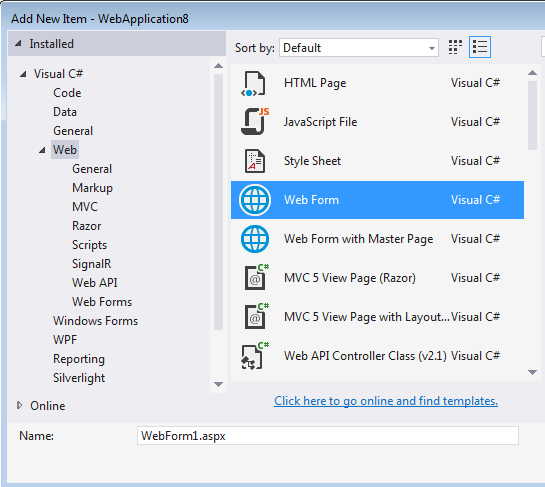
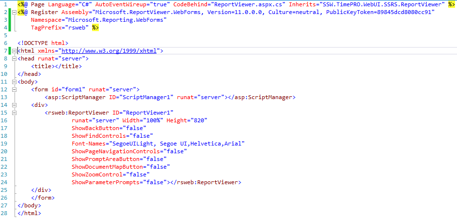
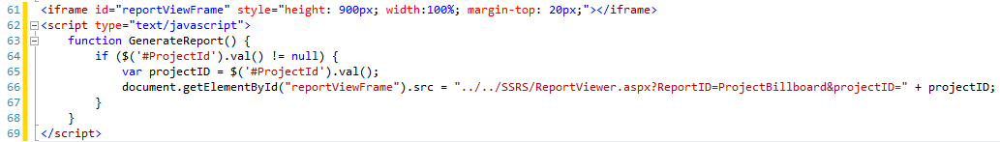
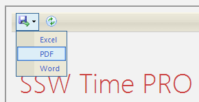
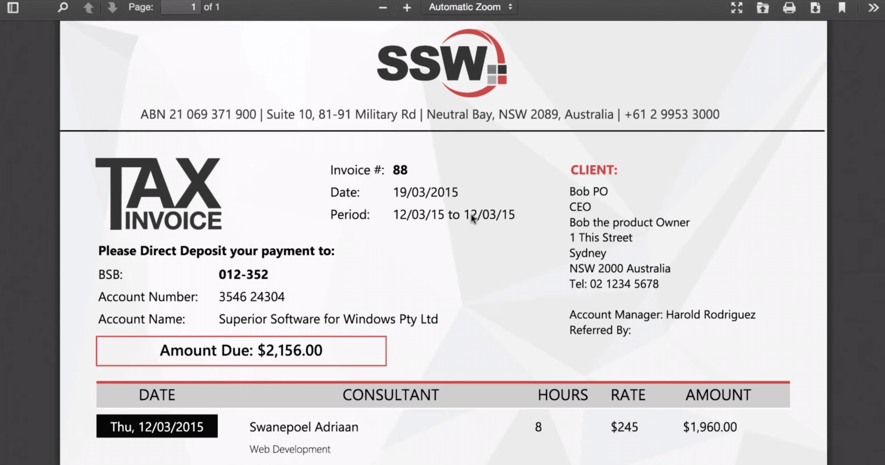

Making reports on websites printable can be difficult. While there are CSS media and rules to help make pages printable, there are always issues with page breaks, browser quirks and tables.  

   
The best and most accurate print solution is to use SQL Server Reporting Services (SSRS). You can use SQL Server Reporting Services in MVC even though its only supported by WebForms.

It's great to include  SQL Server Reporting Services (SSRS) reports in your web application, which can be done with the Microsoft ReportViewer web control...however this only applies to ASP.NET WebForms.

With an iframe and a little bit of code, your reports can also be viewed in your ASP.NET MVC application.

In your MVC project, add a new item of type WebForm.
  
Then add the ReportViewer control to the WebForm.
  
In the View you want to display the report in, add an iframe pointing to your WebForm.

Tie them together, by getting your report parameters from the MVC page and appending them to the query string of the iframe URL.

(The below example uses JavaScript to execute this part from user input)
  
Now you have your SSRS report in your MVC application.
  ](17-06-2014 8-33-37 AM.png) 
### When using Web-API the method above is difficult and time-consuming!
  
The easy solution is to render the report within the API and return it to the user  as a pdf. For an example of how to implement the functionality, read the following series  of articles on ['Integrating SSRS Web-API and AngularJS'](http://blog.chrisbriggsy.com/the-first-step-towards-integration/).
