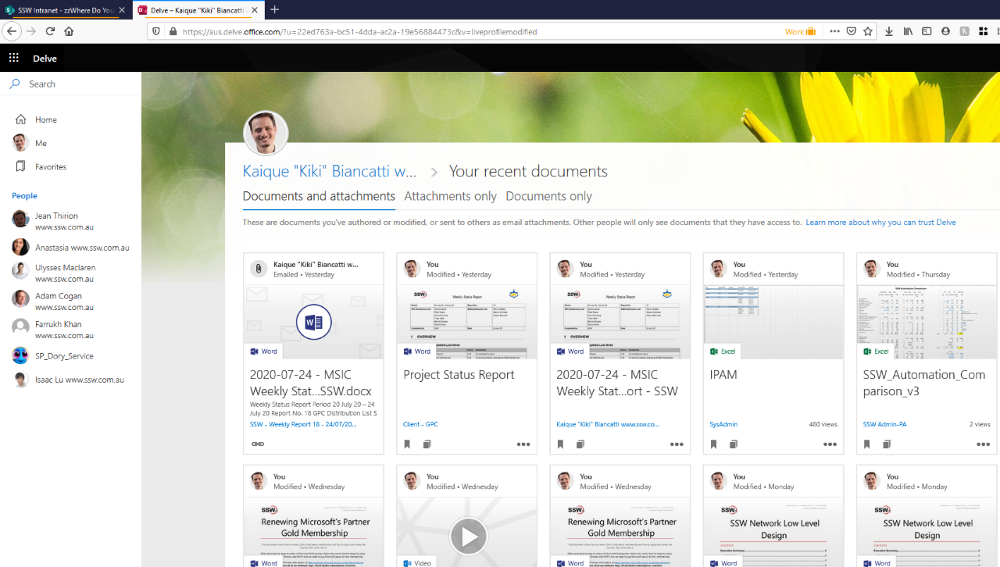

In Bing, if you are logged in to your work account, you can easily see your recent files!
The same works for your work colleagues.

<!--endintro-->

**Suggestion to Microsoft:** Put a checkbox "Show thumbnails" like Delve.

In a slower way, you can go to Delve to see this information with a different UI with big images.

