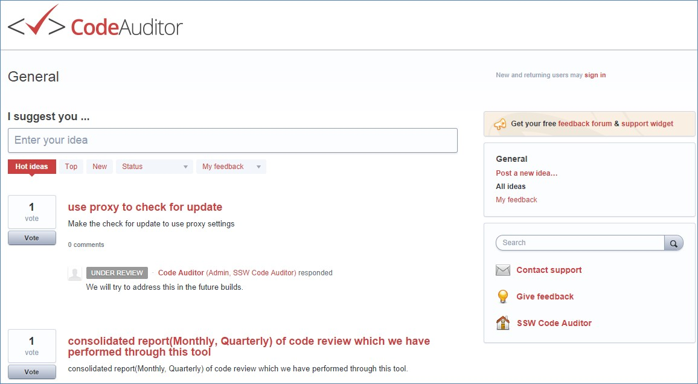
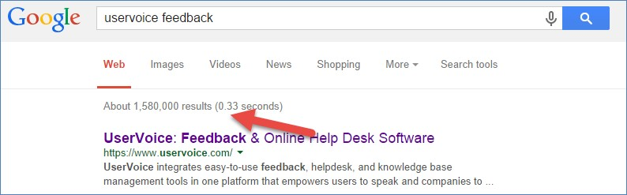

​​​How do you want customers to send you feedback? Phone calls? Emails? A website? 
There are a number of web applications that do a great job on this:
 
- [UserVoice​](https://www.uservoice.com/)
- [GetSatisfication​](https://getsatisfaction.com/corp/)
- [UserEcho​​](https://userecho.com/)

 
 
(used here by SSW Code Auditor)
 

[UserVoice](https://www.uservoice.com/) is the most popular platform to collect, manage, and prioritize user feedback. It has a voting and tickets system out of the box.

Many software houses use this for their products E​g. SSW Code Auditor, SSW Link Auditor

Here are the google results as at 2014

 

 

