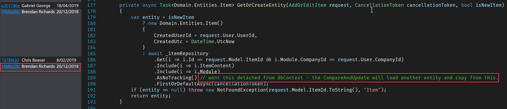

It's important that you have consistent commenting for your code, which can be used by other developers to quickly determine the workings of the application. The comments should always represent the rationale of the current behaviour.
 
Since applications evolve over time - don't add comments to your code with datetime stamps. If a developer needs to see why the code behaves the way it does right now - your commit history is the best place to tell the story of why the code has evolved.

Commands such as git blame or Visual Studio's annotate are great ways of seeing who and when a line of code was changed.

private void iStopwatchOptionsForm\_Resizing(object sender, System.EventArgs e) {
    // Don't close this form except closing this application - using hide instead; 
    if (!this.m\_isForceClose) {
 // 
        // Remind saving the changes if the options were modified.
        if (this.IsOptionsModified) {
            if (MessageBox.Show("Do
you want to save the changes?", Me.GetApplicationTitle, MessageBoxButtons.YesNo,
MessageBoxIcon.Warning) = DialogResult.Yes) {
                this.SaveOptions()
            }
        }
        // 
    }
}
Figure: Bad example - timestamped comments add noise to the code

 Figure: Good example - we can tell who added the comment using annotations
