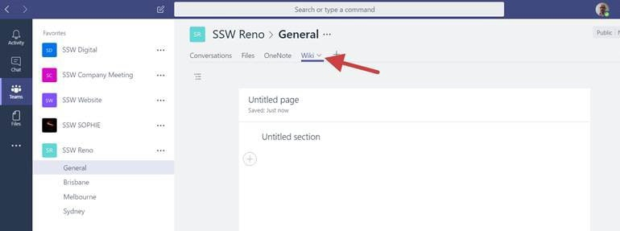
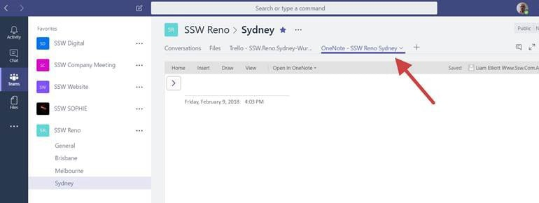

You should use OneNote instead of the default Wiki. This way you can use it offline on your mobile apps.

 

(including offline support)

**Note:** Rename the tab to show that it is a OneNote Tab. E.g.: "**OneNote - SSW Reno Sydney**"
