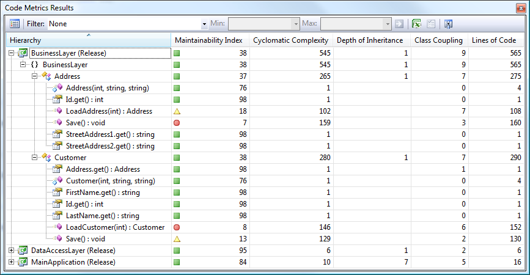

The hot spots identified in your solution often indicate violations of common design principles.

<!--endintro-->

() and Customer.LoadCustomer() looking for SOLID refactor opportunities
The most common problem encountered will be code that violates the Single Responsibility Principle (SRP). Addressing SRP issues will see a reduction in the following 3 metrics:

1. "Cyclomatic Complexity" which indicates that your methods are complex, then
2. "High Coupling" indicates that your class/method relies on many other classes, then
3. "Number of Lines" indicates code structures that are long and unwieldy.


Let's just look at one example.

This code does more than one thing, and therefore breaks the Single Responsibility Principle.


```
public class PrintServer 
{
    public string CreateJob(PrintJob data) { //...
    }
    public int GetStatus(string jobId) { //...
    }
    public void Print(string jobId, int startPage, int endPage) { //...
    }
    public List GetPrinterList() { //...
    }
    public bool AddPrinter(Printer printer) { //...
    }
    public event EventHandler PrintPreviewPageComputed;
    public event EventHandler PrintPreviewReady;
    // ...
}
```

Figure: Bad example - This class does two distinct jobs. It creates print jobs and manages printers

```
public class Printers {
    public string CreateJob(PrintJob data) { //...
    }
    public int GetStatus(string jobId) { //...
    }
    public void Print(string jobId, int startPage, int endPage) { //...
    }
}
public class PrinterManager {
    public List GetPrinterList() { //...
    }
    public bool AddPrinter(Printer printer) { //...
    }
}
```

Figure: Good Example - Each class has a single responsibility
Additionally, code that has high coupling violates the Dependency Inversion principle. This makes code difficult to change but can be resolved by implementing the Inversion of Control  **\*and\*** Dependency Injection patterns.

TODO: Replace example with TailSpin

TODO: Updated Code Metrics diagram after fix
