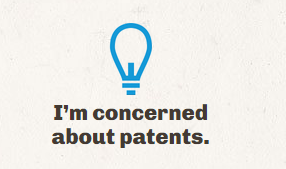

More and more projects are being created as Open Source. However just because you’re created an open source project doesn’t mean you give everything in your cookie jar away. You should only release your code subject to a licence agreement. A common confusion when putting projects onto Open Source platforms like GitHub is ‘What License Should I Use?”. We have our own opinions but we aren’t lawyers so if you want to know what’s best for you speak with your lawyer.

<!--endintro-->

[[badExample]]
| 
[[goodExample]]
| [GNU General Public License on Wikipedia](http://en.wikipedia.org/wiki/GNU_General_Public_License)
[[goodExample]]
| [MIT License on Wikipedia](http://en.wikipedia.org/wiki/MIT_License)
[[goodExample]]
| [Apache License on Wikipedia](http://en.wikipedia.org/wiki/Apache_License)
