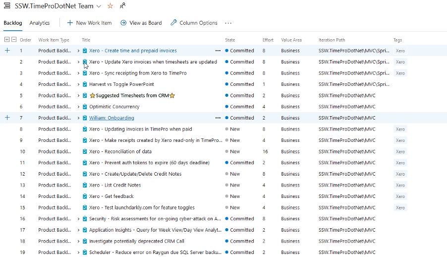
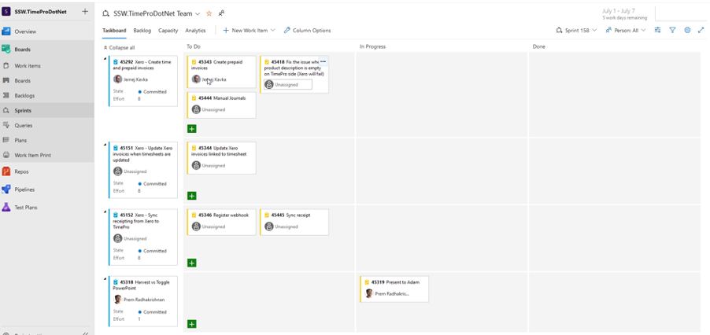

When working on a Time and Materials basis there are two different management arrangements depending on what the client requires.

<!--endintro-->

### A. Ad-Hoc Work (The Client is agreeing to the time)

Working on an ad-hoc basis allows tasks to be done as they are requested without any formal approval process. This is a simple approach but provides little in the way of management or accountability. This may be suitable for ongoing work such as application maintenance with longstanding clients OR working under a client manager.

The ad-hoc work approach should not generally be used for project work where the client wants you to manage project elements such as time, scope, quality, and cost.

This approach can be useful for problems where time or effort is not immediately known and not possible to estimate with the information at hand. The types of work this may include would be support jobs or investigatory work.

There should be an agreement of the time allowed to be spent ahead of time, even if what is being worked on has no scope.

::: good  
  
:::  

### B. Managed Work (using Scrum, the Client is agreeing to an outcome that the consulting company controls)

The alternative is to work with a Scrum Master, or a Project Manager, with specification, and Sprint plans. In this approach, management is applied to provide control and additional communication and controls of the elements of time, scope, quality, and cost.

This method is recommended for any work which is substantial and where the client wants a greater degree of control. 
In this approach, backlog items are created during the Spec Review process while creating the project estimates, which can be used to create the sprints.

::: good  
  
:::  

::: good  
  
:::  

::: good  
  
:::
