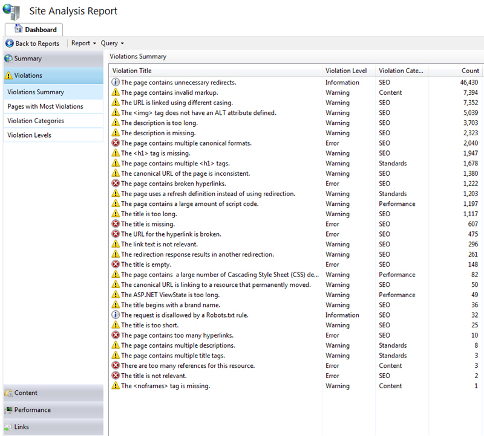

 
​There are a number of things you can do to make your content more search-friendly in IIS.

- Make content search engine-friendly
- Improve volume and quality of traffic
- Control how search engines will access and display content
- Inform search engines about locations that are available for indexing
- Show broken pages

 
​​You can use the [IIS SEO](http://www.iis.net/extensions/SEOToolkit) Toolkit to find most of your problems.
​​Figure: Analyzing your site is easy​​​Figure: You never know how many problems you have until you try​
See [ScottGu's post on IIS Search Engine Optimization Toolkit](http://weblogs.asp.net/scottgu/archive/2009/06/03/iis-search-engine-optimization-toolkit.aspx) for more information​​​

