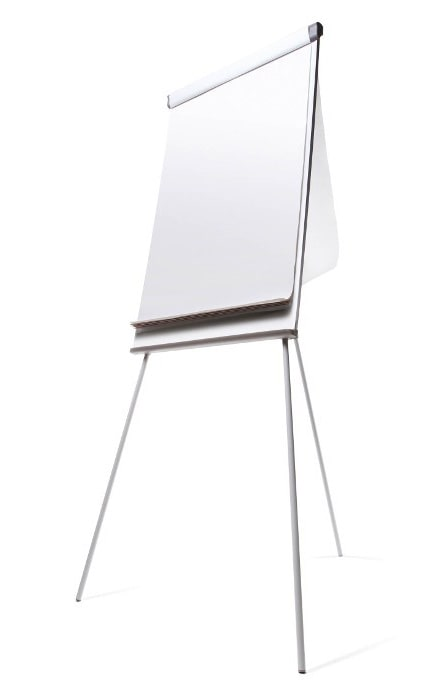

Many people like to use a whiteboard for collaborating and brainstorming, and this works quite well. But a whiteboard is a large ugly object that takes up a fair amount of room, often isn’t kept clean, and doesn’t allow for people to collaborate remotely. There are modern alternatives that work even better:
 
### #1 Laptop and cast to a monitor (recommended)

This could then be screen-shared for remote meeting attendees and is easily saveable/sharable for later.

- PowerPoint
- Visio
- OneNote
- [Mural](https://mural.co/) (collaborative app)

### #2 Tech Whiteboard replacement

- **Samsung Flip** ($3k)
 
 

- **Microsoft Surface Hub 2** (coming - about $5K)

### #3 Paper Whiteboard (Low tech – a large piece of paper)

Old school but it is great to have a pen in hand, you can always just grab a big piece of paper and draw on it together.

### #4 Whiteboard and marker - Low tech (ugly) 

The traditional whiteboard.

Quote from Adam Cogan (apparently not a fan of whiteboards in a tech office):

I believe whiteboards are a sign of an old office… and they are ugly. They’re not a sign of a modern office.
Sometimes they are useful and I know some people really like them (generally older people).
I have seen the digital whiteboards (usually targeted at teachers) but I think they are horrible to use.
The common scenario is for a spec review. I am always happy when I see devs using their device and casting to the TV. And the subsequent notes get saved to Microsoft Teams.

### #5 Writable wall -  Low tech (ugly)

Low tech (ugly) – Paint a wall to be writable or put some writable film on an office glass wall
 

