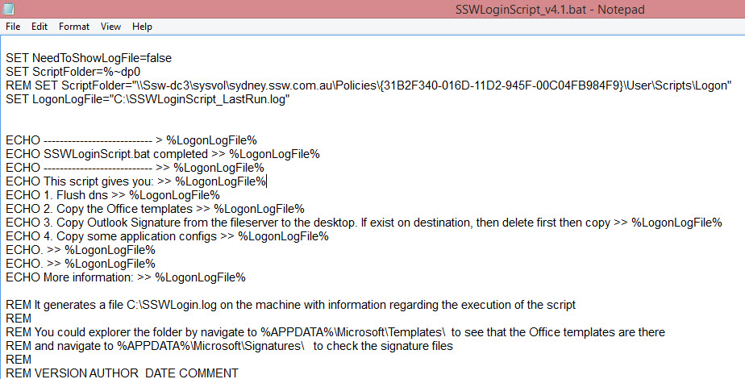
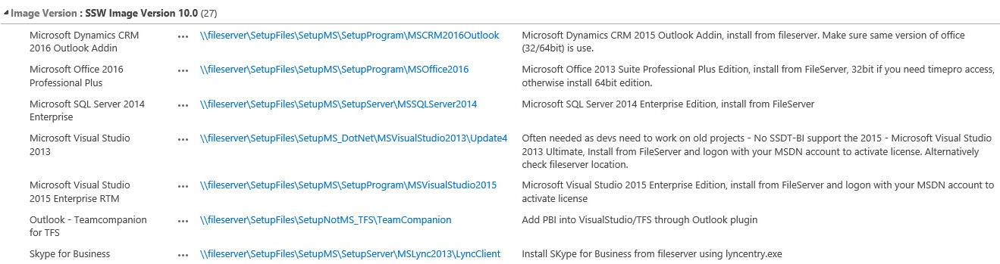

Your developers should be using Windows 10 for a [number of reasons](http://au.pcmag.com/windows-10-preview-release-date-news-features/35511/feature/10-reasons-to-upgrade-to-windows-10), the primary one being it is faster than Windows 8.
The next step is to get the Standard Operating Environment (SOE) installed. You have a few choices:

- Manually - it can take over a day to install your favourite 20 or so apps
- Windows Image - there is overhead of maintaining the .WIM file as software changes
- Use a package manager (eg. chocolatey) - RECOMMENDED

 
### Use a package manager ([Chocolatey](/_layouts/15/FIXUPREDIRECT.ASPX?WebId=3dfc0e07-e23a-4cbb-aac2-e778b71166a2&TermSetId=07da3ddf-0924-4cd2-a6d4-a4809ae20160&TermId=c4c72062-a59d-44fc-8101-8ee008f3ca05))  

Assuming that Windows 10 in already installed, then get your SOE installed fast by following these steps:

1. Logon and configure Windows 10
2. Install Windows Updates
3. Join laptop to the Domain (or run a Logon-Script.bat to get printers, Word templates etc. Contact SysAdmin to join laptop to domain)
4. Install and run a Chocolatey script to get most of the software
    [Chocolatey script](file:///fileserver/SetupFiles/SetupNotMS/ChocolateySSWPackages) for SSW
5. Install all rest of the standard Software that does not support Chocolatey [SSW Only]      [Standard Software](https://intranet.ssw.com.au/SysAdmin/Lists/WinImageInstalledSoftware/AllItems.aspx) for SSW
6. In case you lose your laptop, it is a good idea to stick a business card to the bottom
7. For branding reasons, stick your company sticker to the laptop

  

  ](ChocolateyScript.jpg)
