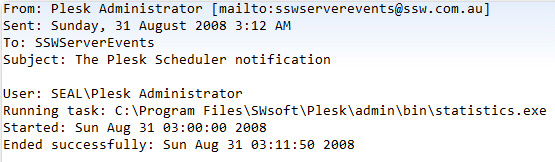
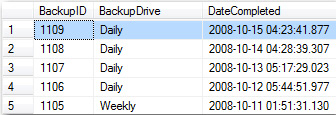

 ​You need to log a record on success so you can check for backups that have failed. 
 Figure: Bad example - an email is sent on completionFigure: Good example - a record is logged on completion
​​​Now you are able to be aware of missing backups. You can make automatically notification based on above table e.g. [by SQL Reporting Services data-driven subscription](https://www.ssw.com.au/ssw/KB/KB.aspx?KBID=Q1455840)
 ​​

