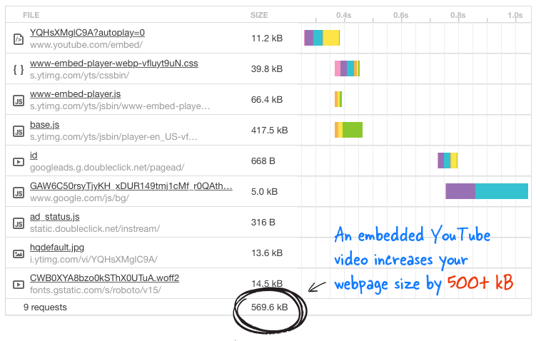

When you embed a YouTube video it will increase your page size from 500kbs to 1.5Mb or more, depending on how many videos are embedded on the page.

  
 

[[badExample]]
|   
[read "A Better Method for Embedding YouTube Videos on your Website"](https://www.labnol.org/internet/light-youtube-embeds/27941/)
`youtube: https://www.youtube.com/embed/eu0qhzevEXQ`
Figure: Bad example – The evil HTML code 
There is a clever, lightweight way to embed a YouTube video, which Google itself practices on their Google+ pages which reduce it to 15kbs.
All you have to do is, whenever you need to embed a video to a page, add the below tag instead of the YouTube video embed code. (Remember to replace VIDEO\_ID with actual ID of the YouTube video)

Figure: Good example – The good HTML code

**Note: **This script needs to be added at the end of the document:

 /\* Light YouTube Embeds by @labnol \*/ /\* Web: http://labnol.org/?p=27941 \*/ document.addEventListener("DOMContentLoaded", function() { var div, n, v = document.getElementsByClassName("youtube-player"); for (n = 0; n < v.length; n++) { div = document.createElement("div"); div.setAttribute("data-id", v[n].dataset.id); div.innerHTML = labnolThumb(v[n].dataset.id); div.onclick = labnolIframe; v[n].appendChild(div); } }); function labnolThumb(id) { var thumb = '', play = '

'; return thumb.replace("ID", id) + play; } function labnolIframe() { var iframe = document.createElement("iframe"); var embed = "https://www.youtube.com/embed/ID?autoplay=1"; iframe.setAttribute("src", embed.replace("ID", this.dataset.id)); iframe.setAttribute("frameborder", "0"); iframe.setAttribute("allowfullscreen", "1"); this.parentNode.replaceChild(iframe, this); } ​

..and this needs to be added in the CSS:

​
