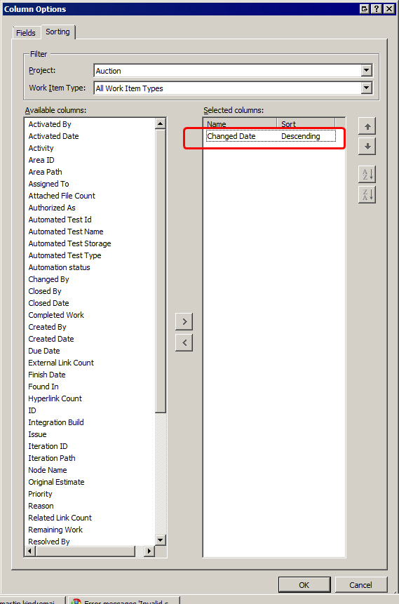

Figure: When you use Check-in policies you often will need to select a work item that you selected recently

<!--endintro-->

Make this easy on yourself by adding a query 'Recent'1. Create a work item query that returns you the last changed work item Figure: Add a query just for your associated check ins
2. Just copy the 'Tasks - My' query
3. Add the sort date of 'Changed Date' sorted by descending Figure: The query should be sorted by 'Changed Date'
4. Use that query on your check ins and you find the relevant work item easily
