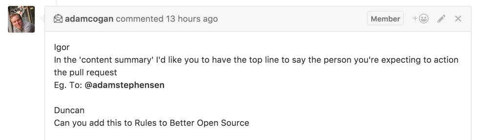
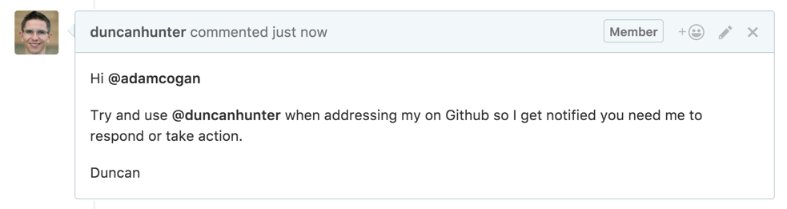

When you make a pull request or need to communicate the next actions someone needs to take in a GitHub comment, you should use a @mention.

Read more about @mention: https://help.github.com/articles/basic-writing-and-formatting-syntax/#mentioning-users-and-teams
 [[badExample]]
| 
[[goodExample]]
| 
