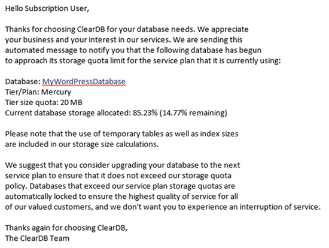
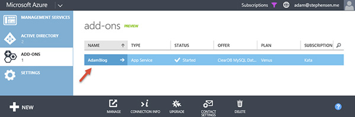

Setting up a WordPress site hosted on Windows Azure is easy and free, but you only get 20Mb of MySql data on the free plan.
 

[John Papa: Tips for WordPress on Azure](http://www.johnpapa.net/azurecleardbmysql/)
