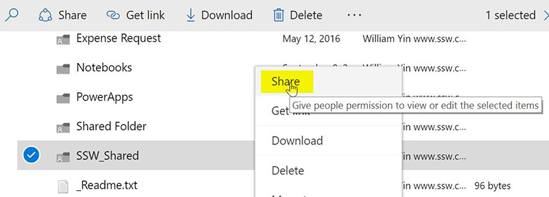
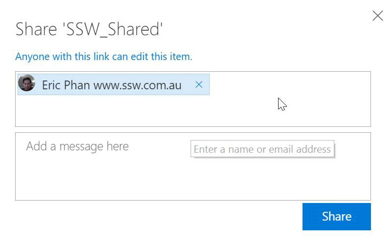

Among other things, it means never sending attachments in an email. Once an attachment is included in an email there are multiple copies of that attachment. If people change the contents of the attachment there is confusion about who holds the "master version" of that file. 
   SharePoint changes this by allowing you to easily email a link to a SharePoint file. This means all recipients review and edit the single "master version" of the file.   
 
