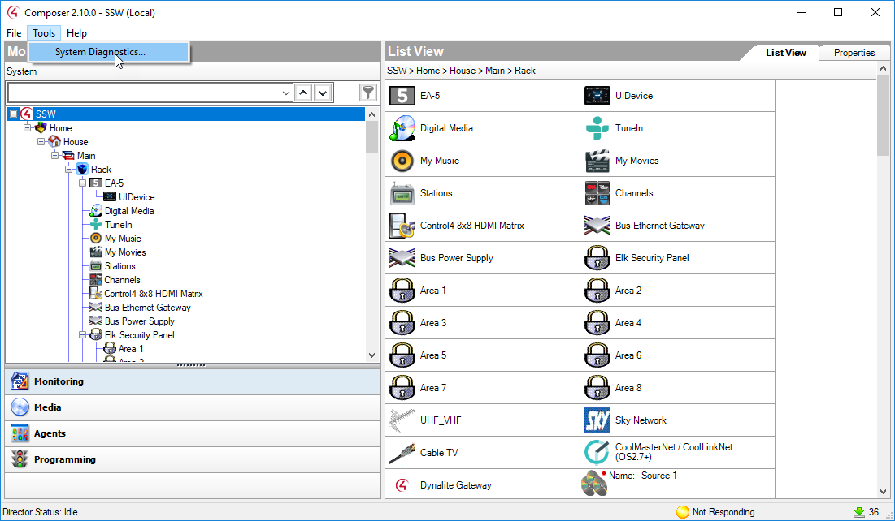
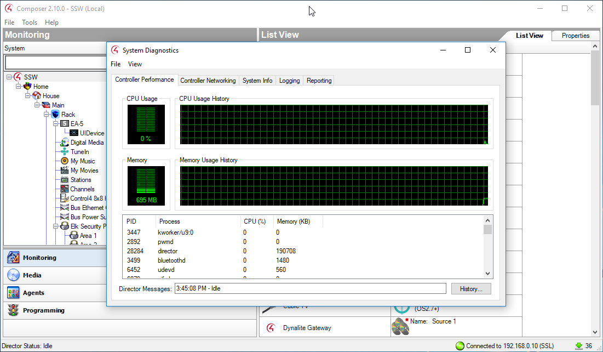

 If your Control4 system is running slowly, there's a System Diagnostics tool that you can use to check CPU and Memory usage, and other details on the Control4 Director box.
 
To access Control4 System Diagnostics, open Composer. ​

Select Tools > System Diagnostics. 

 

 ​

