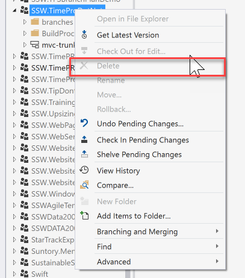
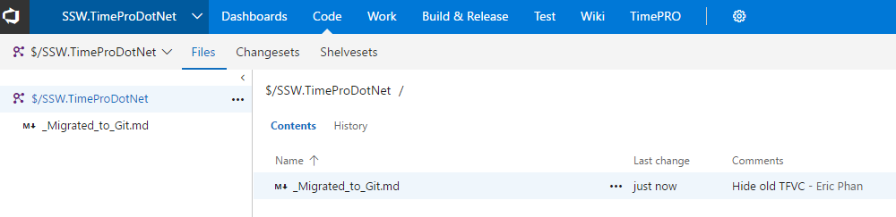
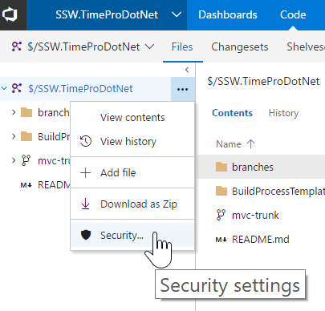
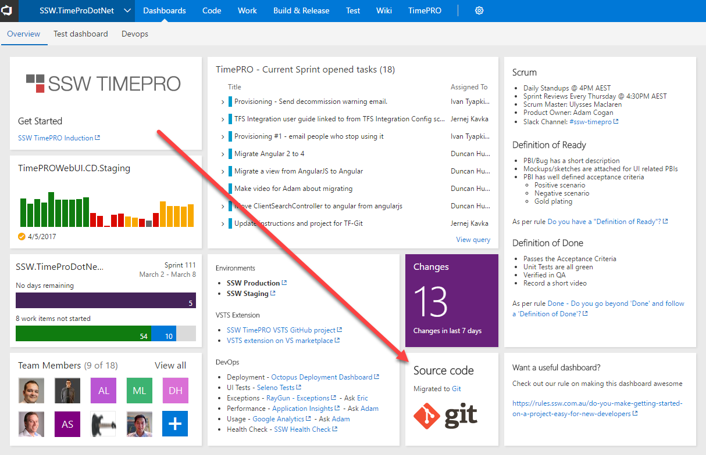
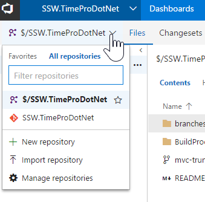

 ​After you [use the right tool to migrate from TFVC to Git](/Pages/Do-you-know-the-best-tool-to-migration-from-TFVC-to-Git.aspx), there's a few more things you need to do to clean things up for a new user joining the project. By default, if there is a TFVC repository, that will become the default in the UI.

Unfortunately, you can't kill the TFVC repository and make Git the default one, so there's a few steps you need to follow.

​

 
​
​Figure: Bad Example - Can't delete the now deprecated​ TFVC repository​​

### Delete files from TFVC

Go into the repository, delete any existing files. Add a new document saying "\_Migrated\_to\_Git.md". This will stop people from getting the wrong code.

​​​​Figure: Clean up TFVC so developers can't accidentally get the wrong source code

**Note**: All the source code is still there, it's just flagged as being deleted.

### Lock down TFVC

In the TFVC repository, click Security

​
Figure: Con​​figure the security of the TFVC repository

​​Then deny check-ins to **Contributors**, P**roject Administrators** and **Project Collection Administrators**. This should stop anyone from committing new code to the repository.

### Update the Dashboard

​Next step is to update the dashboard to let new developers know.

​​
​​Figure: Good example - Let new users know that the source control is now on Git

​​

### ​Suggestions for the VSTS team

1. ​​Give us the ability to hide a repository
2. Give us the ability to set a repository as the default for all users
3. Give us the ability to delete a TFVC repository

Having any of these suggestions will avoid the confusion on this screen

​​Figure: Bad Exmaple - This is confusing for a new dev

