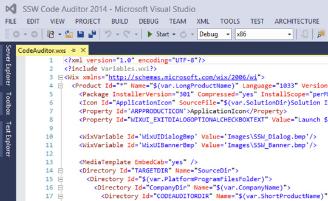
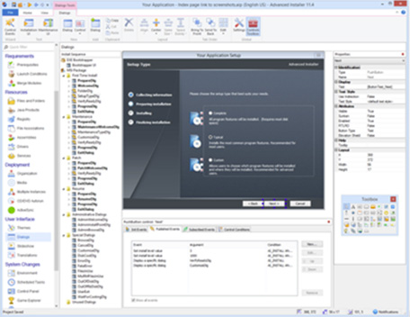

Market is full of tools that can create Setup packages, but only a few are really good.
 
**WiX** is the ultimate tool which gives you complete freedom and control over Setup packages.

Here are reasons why WiX is the way to go:

- It is all done in XML
- It integrates with Visual Studio
- Full control over packages logic and UI
- It is a recommended choice by Microsoft
- It is FREE

[[goodExample]]
| 
But WiX has one bad side as well – learning curve is high. Not everyone can afford learning it. The alternative is Advanced Installer.

**Advanced Installer** makes it easy for you to create Setup packages using a very sophisticated GUI.

A few reasons why Advanced Installer could be your choice:

- It has a very sophisticated and easy to use GUI
- It gives you wide range of options (IIS, Dialog Editor, Custom Actions, Digital Signature, Auto Updater, App Virtualization, SCCM, etc)
- Price vs performance ratio is great + it has a FREE version which is in many cases more than enough

[[goodExample]]
| 
