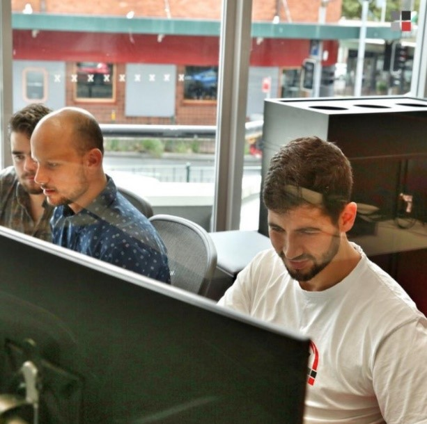
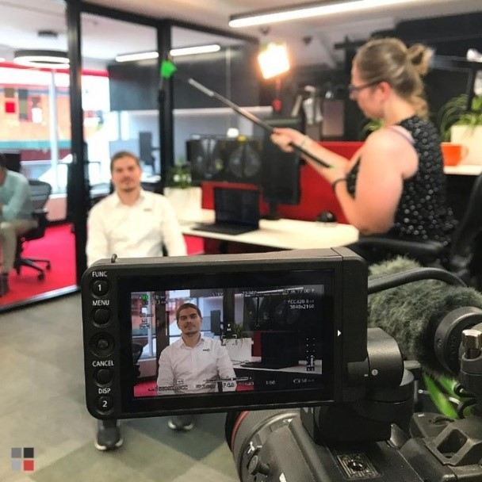
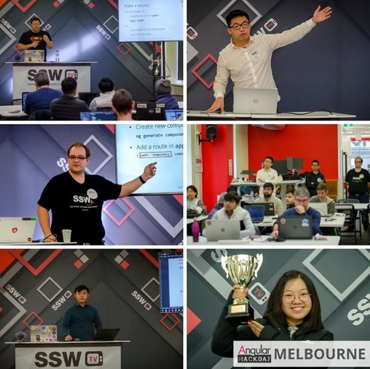
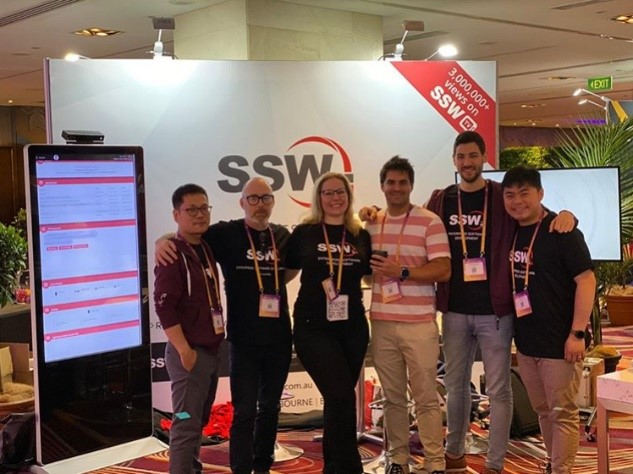
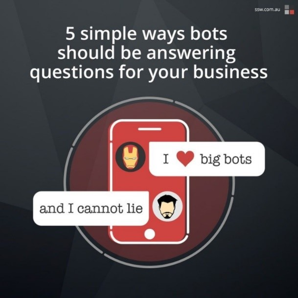
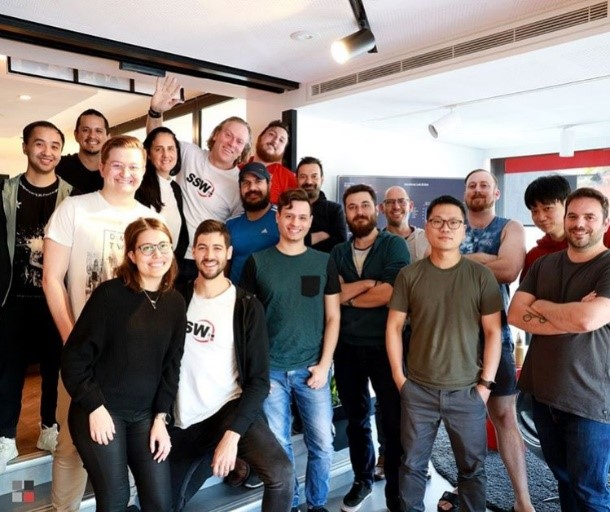

 
​Sometimes it can be hard to keep generating content daily for your social media, and even more when there’s not much going on.​​
 
​So, here are a few examples taken from our social media of what you could post on yours:

### ​Internal projects, services or products that your business developed or offers​
Figure: SSW’s devs doing a scrum retro with General Manager Uly after working on        [SSW TimePro​](https://sswtimepro.com/)
### ​​Projects that your company worked on​
Figure: SSW's developer Kosta being recorded by SSW TV about the web app that SSW developed for Sydney University​
### Video content​
​Figure: SSW TV Tech tips recorded during NDC 2019 on YouTube​ -        [Watch the playlist here​](https://www.youtube.com/playlist?list=PLpiOR7CBNvlqSNO-jkFxuAqy9uL6vnfkx)
### Events that your company organised
Figure: Clean Architecture Superpowers paid training promotion on SSW's socialsFigure:        [Angular Hack Day](https://angularhackday.com/) post-event post

### External events that you and your team attended to
Figure: SSW’s team in our booth at NDC Sydney 2019 with Alumnus Tiago Passos
### Your team members profile
Figure: In profile photos, you can show your employees in action
### Your employee's blogs posts
Figure: Use the same image from the blog post for consistency
### Your business blog posts
Figure: When you promote your own business' blog post on your social media, try to use the same design & branding
### General content wrote by your team on your website

Figure: Even though some of your content doesn’t have a photo, you can add a relevant one from free stock photo services, like the above
### Employment opportunities
Figure: Hiring post following branding guidelines
### Teamwork, parties, etc
Figure: A team shot just before NDC with part of the SSW China office
### Relevant news for your industry
Figure: If you don’t have a catchy photo to represent your news, try free stock photo websites like        [Pexels](https://www.pexels.com/) or        [Unsplash​](https://unsplash.com/)
### Memes, if they suit your industry

​To see best practices for sharing memes on your socials, check out our Rule: ​[Do you know why you should use memes as part of your business social media content?](/_layouts/15/FIXUPREDIRECT.ASPX?WebId=3dfc0e07-e23a-4cbb-aac2-e778b71166a2&TermSetId=07da3ddf-0924-4cd2-a6d4-a4809ae20160&TermId=a79d64e4-ed1b-441a-9db1-95e1777c7b12)
      ​Figure: A meme once a week on weekends can help you boost your social media engagement​

