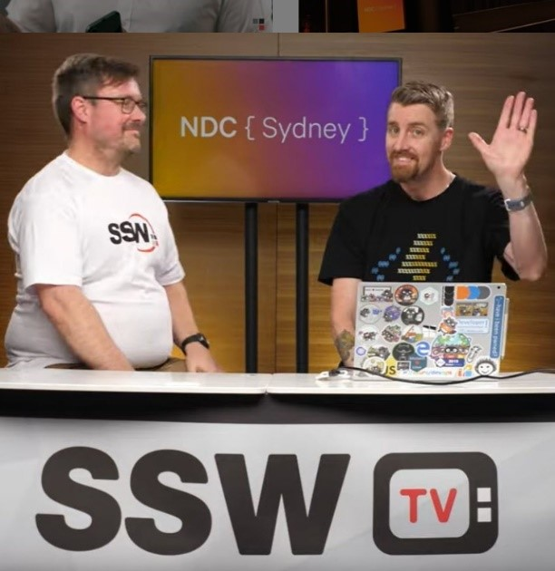
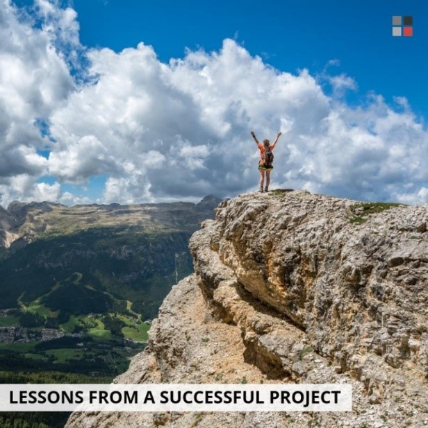

Sometimes it can be hard to keep generating content daily for your social media, and even more when there’s not much going on.

<!--endintro-->

So, here are a few examples taken from our social media of what you could post on yours:

### Internal projects, services or products that your business developed or offers

[SSW TimePro](https://sswtimepro.com/)
### Projects that your company worked on

### Video content

[Watch the playlist here](https://www.youtube.com/playlist?list=PLpiOR7CBNvlqSNO-jkFxuAqy9uL6vnfkx)
### Events that your company organised

post-event post[Angular Hack Day](https://angularhackday.com/)
### External events that you and your team attended to

### Your team members profile

### Your employee's blogs posts

### Your business blog posts

### General content wrote by your team on your website

### Employment opportunities

### Teamwork, parties, etc

### Relevant news for your industry

[Unsplash](https://unsplash.com/)or[Pexels](https://www.pexels.com/)
### Memes, if they suit your industry

To see best practices for sharing memes on your socials, check out our Rule: [Do you know why you should use memes as part of your business social media content?](/_layouts/15/FIXUPREDIRECT.ASPX?WebId=3dfc0e07-e23a-4cbb-aac2-e778b71166a2&TermSetId=07da3ddf-0924-4cd2-a6d4-a4809ae20160&TermId=a79d64e4-ed1b-441a-9db1-95e1777c7b12)

