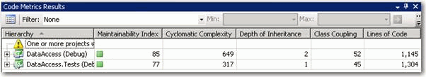

In general you should always be looking to simplify your code (e.g. heavily nested case statements). As a minimum look for the most complicated method you have and check that it needs simplifying.

In Visual Studio, there is inbuilt support for Cyclomatic Complexity analysis.

<!--endintro-->

1. Go to Developer > Code Metrics > Generate for Solution

2. Look at the largest Cyclomatic Complexity number and refactor.

